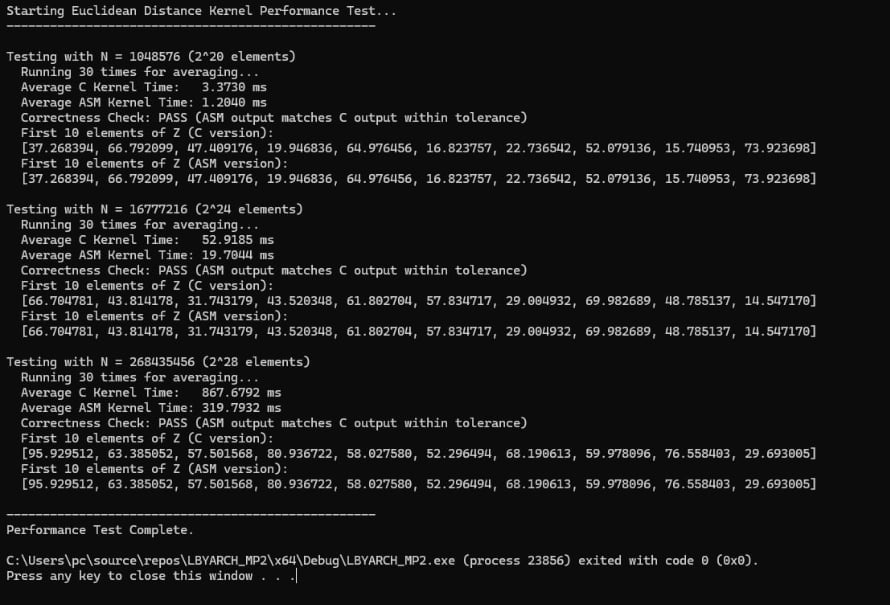

## Program Output & Correctness Check

The following screenshot demonstrates the program's output, showing the comparative execution times for both the C and x86-64 assembly kernels, along with the correctness check which confirms the assembly output matches the C output within tolerance.

### Comparative Execution Time

| Vector Size (N) | N (2^X elements) | Average C Kernel Time (ms) | Average ASM Kernel Time (ms) | Speedup (C / ASM) |
| :-------------- | :--------------- | :------------------------- | :--------------------------- | :---------------- |
| 1,048,576       | 2^20             | 3.3730                     | 1.2040                       | ~2.80x            |
| 16,777,216      | 2^24             | 52.9185                    | 19.7044                      | ~2.68x            |
| 268,435,456     | 2^28             | 867.6792                   | 319.7932                     | ~2.71x            |

*(Note: The largest vector size tested was 2^28 elements instead of 2^30 due to memory constraints on typical development machines.)*

### Short Analysis of Performance

As observed in the table above, the x86-64 assembly kernel consistently demonstrates a significant performance improvement over the equivalent C kernel. The assembly version achieves a speedup ranging from **approximately 2.68x to 2.80x** across all tested vector sizes.

This performance gain is primarily attributed to the following:

1.  **Scalar SIMD (SSE) Instruction Utilization:** The assembly code directly employs SSE instructions (`movss`, `subss`, `mulss`, `addss`, `sqrtss`) for floating-point arithmetic. These instructions execute on dedicated SIMD units within the CPU, which are highly optimized for single-precision float operations, often outperforming the general-purpose floating-point operations that a C compiler might generate for individual floats.
2.  **Optimized Register Usage:** The assembly kernel strategically uses callee-saved registers (RDI, RSI, R12, R13, R14) to hold pointers (`X1`, `X2`, `Y1`, `Y2`, `Z`) and the loop counter (`RAX`). Keeping these frequently accessed values in fast CPU registers minimizes memory accesses within the core loop, reducing cache misses and memory latency. A C compiler might spill registers to the stack more often, introducing overhead.
3.  **Precise Control over Instructions:** Assembly language provides direct control over the exact instructions executed. This allows for fine-tuned optimizations that might not always be performed by a high-level C compiler, especially for small, performance-critical loops like this kernel.

The consistent speedup across varying data sizes also indicates that the assembly kernel's loop structure and memory access patterns are efficient and scale well with larger datasets.

## Deliverables

This GitHub repository contains the complete Visual Studio 2022 project folder, including:

*   Source code files (`.c`, `.h`, `.asm`)
*   Visual Studio solution (`.sln`) and project (`.vcxproj`) files
*   `README.md` file (this document)

Additionally, per project requirements, the following short videos should be provided separately:

*   Video demonstrating C source code, compilation, and execution.
*   Video demonstrating x86-64 assembly source code, compilation, and execution.